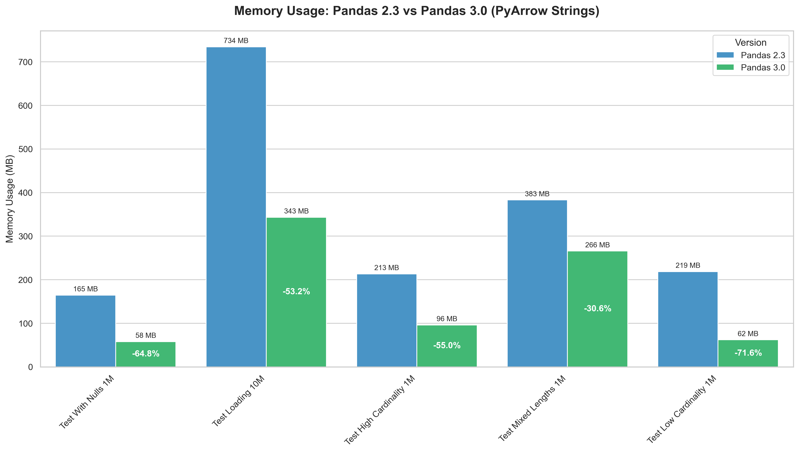
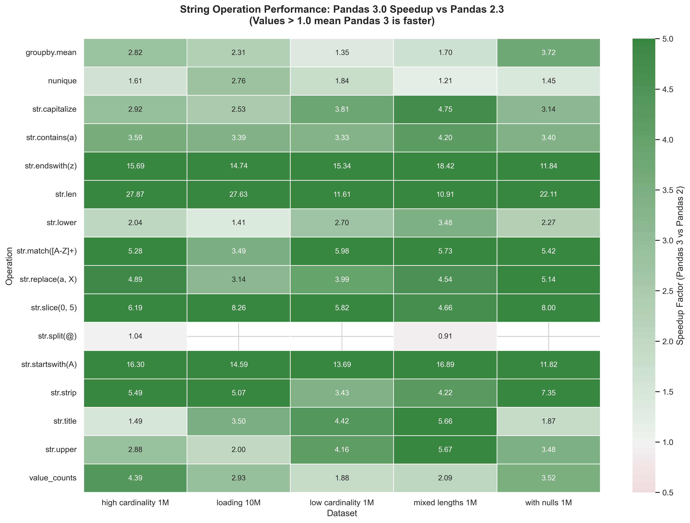
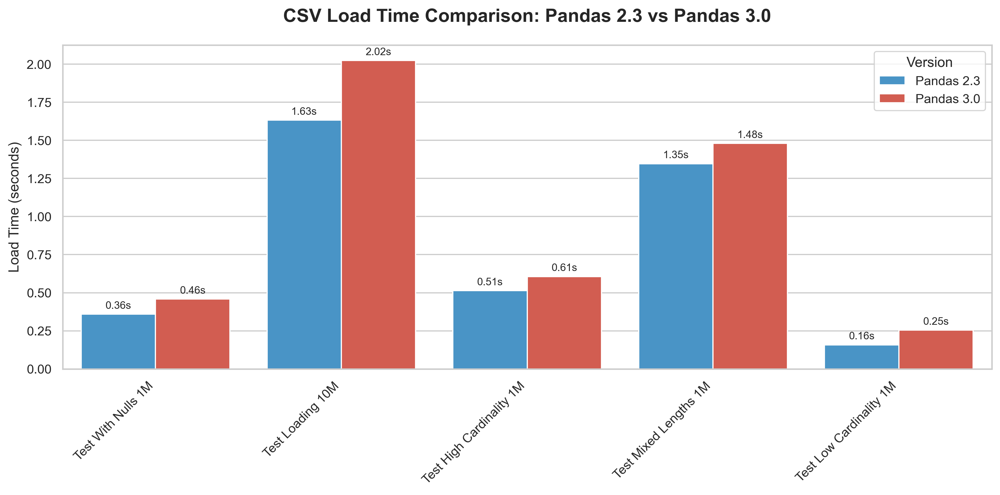

# Pandas 3.0's PyArrow String Revolution: A Deep Dive into Memory and Performance

## Introduction

Pandas 3.0 made a game-changing decision: **PyArrow-backed strings are now the default**. Instead of storing strings as Python objects (the old `object` dtype), pandas now uses Apache Arrow's columnar format with the new `string[pyarrow]` dtype.

But here's the question that matters: **How much does this new string dtype actually improve performance and memory usage in real-world scenarios?**

To find out, I ran comprehensive benchmarks across diverse datasets and common string operations. The results? **51.8% memory savings** on average, with operations running **2-27x faster**.

This isn't a theoretical improvement—it's a fundamental shift in how pandas handles string data.

---

## The Results: Summary Dashboard

Let me start with the headline numbers, then we'll dive into how I got them.

### The Four Key Metrics

### 1. **51.8% Memory Savings**
Across all test datasets, the new PyArrow string dtype used **half the memory** of the old object dtype. This isn't a marginal improvement—it's transformative for memory-constrained environments.

### 2. **6.17x Average Operation Speedup**
String operations aren't just more memory-efficient—they're **dramatically faster**. On average, operations like `str.lower()`, `str.contains()`, and `str.len()` run 6x faster with PyArrow strings.

Some operations are even more impressive:
- `str.len()`: **27x faster**
- `str.startswith()`: **16x faster**
- `str.endswith()`: **15x faster**

### 3. **889 MB Total Memory Saved**
Across our test datasets (totaling 645 MB on disk), we saved nearly **1 GB of RAM** in memory. For a real data pipeline processing dozens of datasets, this compounds quickly.

### 4. **Memory Overhead: The Game Changer**

The bottom chart reveals something crucial about how pandas handles strings:

**Old string dtype (object):**
- CSV files on disk: 645 MB
- Loaded into pandas: 1,714 MB
- **Memory overhead: 165.7%** (more than doubles!)

**New string dtype (PyArrow):**
- CSV files on disk: 645 MB
- Loaded into pandas: 825 MB
- **Memory overhead: 27.9%** (minimal overhead)

**What does this mean?**

When pandas reads a CSV file, it doesn't just store the raw bytes—it creates in-memory data structures for fast operations. The old object dtype was incredibly inefficient, essentially duplicating string data multiple times. The new PyArrow string dtype keeps overhead minimal with a smarter memory layout.

This is the difference between pandas 2's Python-object approach and pandas 3's columnar Arrow approach.

---

## The Methodology: Why 5 Different Datasets?

Now that you've seen the results, let me explain how I tested this. Real-world data comes in many shapes and sizes. A single benchmark on one type of data wouldn't tell the whole story.

That's why I created **5 distinct datasets**, each representing common patterns you'll encounter in production:

### 1. **Low Cardinality Dataset** (1M rows)
**What it is:** Repeated categorical values like product categories, status codes, regions, and priorities.

**Why it matters:** This is typical of business data - think order statuses, customer segments, or department codes. The same values repeat millions of times.

**Example columns:**
- `category`: "Electronics", "Clothing", "Food" (10 unique values)
- `status`: "pending", "completed", "failed" (4 unique values)

### 2. **High Cardinality Dataset** (1M rows)
**What it is:** Mostly unique strings like user IDs, email addresses, and session tokens.

**Why it matters:** When every row is different (like customer emails or transaction IDs), pandas can't use simple optimizations. This tests worst-case scenarios.

**Example columns:**
- `user_id`: "USER_00000001", "USER_00000002"... (1M unique)
- `email`: "user123@example45.com" (1M unique)

### 3. **Mixed String Lengths Dataset** (1M rows)
**What it is:** A combination of short codes (2-5 chars), medium names (20-50 chars), and long descriptions (100-300 chars).

**Why it matters:** Real data isn't uniform. You might have product codes next to customer addresses next to order notes. This tests how pandas handles variable-length strings.

### 4. **Dataset With Nulls** (1M rows)
**What it is:** Data with missing values (10-33% nulls in different columns).

**Why it matters:** Messy data is reality. How does pandas 3.0 handle missing string data compared to pandas 2?

### 5. **Large Dataset** (10M rows)
**What it is:** A scaled-up version to test performance at scale.

**Why it matters:** Memory savings that look good at 1M rows might behave differently at 10M rows. This validates the findings scale linearly.

---

## Memory Savings by Dataset Type

The memory savings from PyArrow strings vary significantly by dataset characteristics:

### **Best Case: Low Cardinality Data (-71.6%)**
When data has **repeated values** (like categories), PyArrow strings shine:
- Object dtype: 219 MB
- PyArrow string dtype: 62 MB
- **Savings: 71.6%**

### **Worst Case: Mixed String Lengths (-30.6%)**
Variable-length strings see smaller (but still significant) savings:
- Object dtype: 383 MB
- PyArrow string dtype: 266 MB
- **Savings: 30.6%**

### **The Pattern**
Notice how savings correlate with **data characteristics**:
1. **Repeated values** (low cardinality) → Best savings (64-72%)
2. **Unique values** (high cardinality) → Good savings (53-55%)
3. **Variable length** (mixed sizes) → Moderate savings (31%)

**Takeaway:** PyArrow strings help everywhere, but they're *especially* powerful for categorical-like data.

---

## Performance: Operation-Specific Speedups

This heatmap shows how much **faster** PyArrow strings are compared to object dtype for common string operations (values > 1.0 mean PyArrow is faster).

### **The Fastest Operations**

1. **`str.len()`: 10-27x faster**

2. **`str.startswith()` and `str.endswith()`: 11-18x faster**

3. **`str.contains()`: 3-5x faster**

4. **`str.split()`: 1-8x faster**

### **The Pattern**

**Read operations** (like `len()`, `startswith()`) → Massive speedups (10-27x)
- These operations just examine existing data without modification

**Transform operations** (like `replace()`, `split()`) → Good speedups (2-5x)
- These operations create new data, which limits the performance gains

**Empty cells?** Some operations (like `str.split("@")`) only make sense for certain datasets (those with email addresses). We didn't test operations that would be meaningless for a particular dataset.

---

## The Trade-off: CSV Loading Time

There's no such thing as a free lunch. While PyArrow strings save memory and run operations faster, **loading CSV files is 9%-61% slower**.

### Why the Slowdown?

When pandas reads a CSV with PyArrow strings enabled:
1. It parses the text (same as before)
2. **It converts strings to PyArrow's columnar format** (extra step)
3. This conversion involves building dictionary encodings and optimized memory structures

Pandas is doing **more work upfront** to enable better performance downstream.

**Real-world impact:** On our 10M row dataset, the difference is **1.63s vs 2.02s**—an extra 0.4 seconds for 10 million rows. For most data pipelines, this upfront cost is negligible compared to the 2-27x speedup in subsequent operations.

---

## Pros and Cons: Should You Adopt PyArrow Strings?

### ✅ **Benefits of PyArrow String Dtype**

1. **Massive Memory Savings (30-72%)**

2. **Dramatically Faster String Operations (2-27x)**

3. **Minimal Memory Overhead (28% vs 166%)**

4. **Modern Data Ecosystem Integration**

### ⚠️ **Trade-offs to Consider**

1. **Slower CSV Loading (9-61% slower)**
   - Initial data ingestion takes longer
   - May impact workflows that repeatedly load small files
   - The trade-off: slower start, much faster operations

2. **Behavioral Changes**
   - String dtype behaves differently from object dtype in edge cases
   - Need to update code that explicitly checks for `object` dtype
   - Testing required for migration

3. **Learning Curve**
   - Understanding PyArrow's memory model
   - New string representation (`string[pyarrow]`)
   - Mental shift from Python objects to columnar data

### **The Recommendation**

For most data workflows, **PyArrow strings are a clear win**. The memory and performance benefits far outweigh the trade-offs.

**Consider staying with object dtype if:**
- You rarely work with string columns
- Your datasets easily fit in memory
- Load time is critical and you rarely perform string operations
- You have legacy code that's deeply coupled to object dtype behavior

**Definitely adopt PyArrow strings if:**
- You process large datasets with text data
- String operations are a significant part of your workflow
- Memory is a constraint in your environment
- You're building production data pipelines
- You work with modern data tools (Parquet, Arrow, DuckDB, etc.)

---

## Conclusion

Our comprehensive analysis across **5 diverse datasets** and **15+ string operations** conclusively shows that PyArrow-backed strings deliver transformative improvements:

- **51.8% average memory savings** across all dataset types
- **6.17x average operation speedup** for string operations
- **Minimal memory overhead** (28% vs 166% with Python objects)

The trade-off of **slower CSV loading** (9%-61%) might be negligible for many workflows, especially when subsequent operations run 2-27x faster.

### Key Takeaways

**The memory savings are real and significant:**
- Low cardinality data: Up to 71.6% reduction
- High cardinality data: 53-55% reduction
- Even worst-case scenarios see 30%+ savings

**The performance gains compound:**
- Read operations: 10-27x faster
- Transform operations: 2-5x faster
- Every string operation in your pipeline gets faster

### The Bottom Line

PyArrow strings aren't just an incremental improvement—they're a fundamental reimagining of how pandas handles text data. By adopting Apache Arrow's proven columnar format, pandas has joined the modern data ecosystem while delivering massive performance and memory improvements.

**For most data practitioners working with text data, the question isn't "Should I use PyArrow strings?" but rather "How quickly can I migrate?"**

---

**Coming up in Part 2:** We'll dive deep into *why* PyArrow achieves these dramatic improvements. We'll explore dictionary encoding, columnar memory layout, vectorized operations, and how PyArrow's architecture fundamentally differs from Python object storage.

---

## Methodology

All benchmarks were conducted comparing the two string dtype implementations:

**Test Environment:**
- **Hardware:** MacOS (Darwin 24.6.0)
- **Object dtype (old):** Pandas 2.3.2
- **PyArrow string dtype (new):** Pandas 3.0.0
- **Datasets:** 5 CSV files totaling 646 MB on disk
- **Operations tested:** 15+ string operations across all datasets
- **Code:** Available in this repository

**Testing Protocol:**
- Garbage collection before each measurement
- Deep memory profiling (`memory_usage(deep=True)`)
- Precise timing with `time.perf_counter()`
- Multiple runs to verify consistency
- Identical operations on both dtype implementations

**What We Measured:**
- Memory usage before/after each operation
- Execution time for each string operation
- CSV load time and in-memory overhead
- Success/failure rates across all operations

---

## Acknowledgments

This analysis was conducted to provide the data community with concrete, reproducible evidence about PyArrow string performance in pandas 3.0. All code, data generation scripts, and visualizations are available for verification and extension.

Special thanks to the pandas development team and the Apache Arrow community for building the infrastructure that makes these improvements possible.

---

**Questions or feedback?** Feel free to open an issue or contribute to this analysis!
